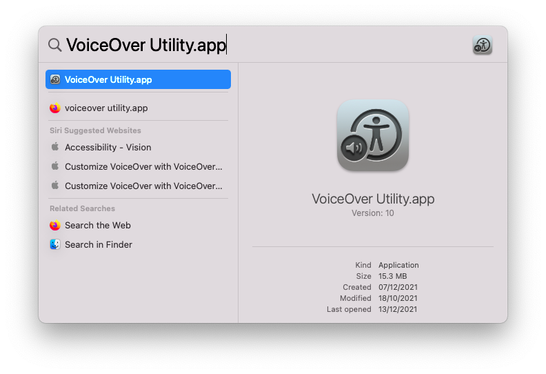
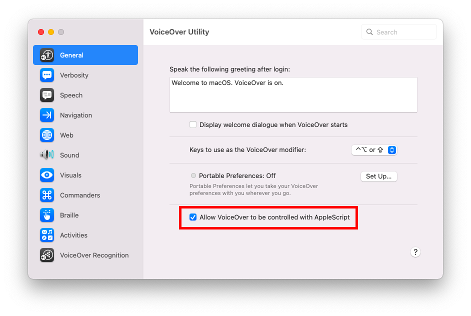
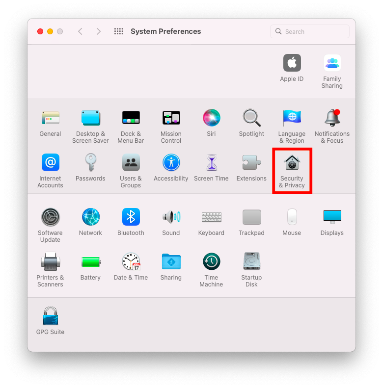
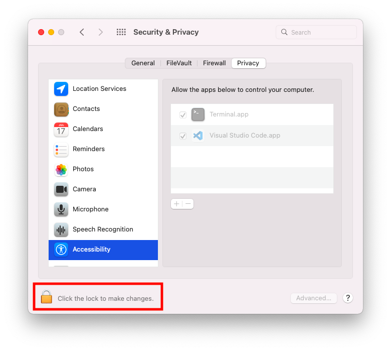

# VoiceOver Prerequisites

## Manual Local Setup

### Allow VoiceOver to be controlled

This setup is required to allow VoiceOver to be controlled by Guidepup.

1. Open the "VoiceOver Utility" application.

   

2. On the "General" tab, tick the checkbox "Allow VoiceOver to be controlled with AppleScript".

   

### Allow app automation

This setup is required to allow applications, e.g. your terminal or IDE, to control other applications, i.e. VoiceOver.

1. Open the "Security & Privacy" application within "System Preferences". Choose the "Privacy" tab.

   

2. Select the "Accessibility" option and click on the padlock to unlock configuration. This will require you to enter an admin username and password.

   

3. In the "Allow the apps below to control your computer." section, use the plus "+" button to add any application that you will run a Guidepup script from - this will likely be your preferred terminal or IDE. Ensure you have also ticked the checkbox next to each application that you will run a Guidepup script from.

   

## CI Setup

### Allow VoiceOver to be controlled

For VoiceOver to be controlled by AppleScripts the following needs to be run:

```bash
# Create VoiceOver database file
sudo bash -c 'echo -n "a" > /private/var/db/Accessibility/.VoiceOverAppleScriptEnabled'

# Update system preference defaults
defaults write com.apple.VoiceOver4/default SCREnableAppleScript -bool true
```

> Note: for the `.VoiceOverAppleScriptEnabled` file to be created you must first disable SIP. This can only be performed whilst in Recovery Mode. Please refer to the [Apple documentation](https://developer.apple.com/documentation/security/disabling_and_enabling_system_integrity_protection) for more details.

### Allow app automation

In order for applications (e.g. a CI terminal) to control other applications (e.g. VoiceOver) using AppleScripts, updates need to be made to the TCC.db.

Please refer to the following examples of how to update the TCC.db for your desired application(s):

- [actions/virtual-environments](https://github.com/actions/virtual-environments/blob/main/images/macos/provision/configuration/configure-tccdb-macos11.sh) - GitHub Actions TCC.db setup
- [CircleCI-Public/macos-orb](https://github.com/CircleCI-Public/macos-orb/blob/main/src/commands/add-uitest-permissions.yml) - CircleCI MacOS Orb TCC.db setup

> Note: for system TCC.db updates you must first disable SIP. This can only be performed whilst in Recovery Mode. Please refer to the [Apple documentation](https://developer.apple.com/documentation/security/disabling_and_enabling_system_integrity_protection) for more details.
